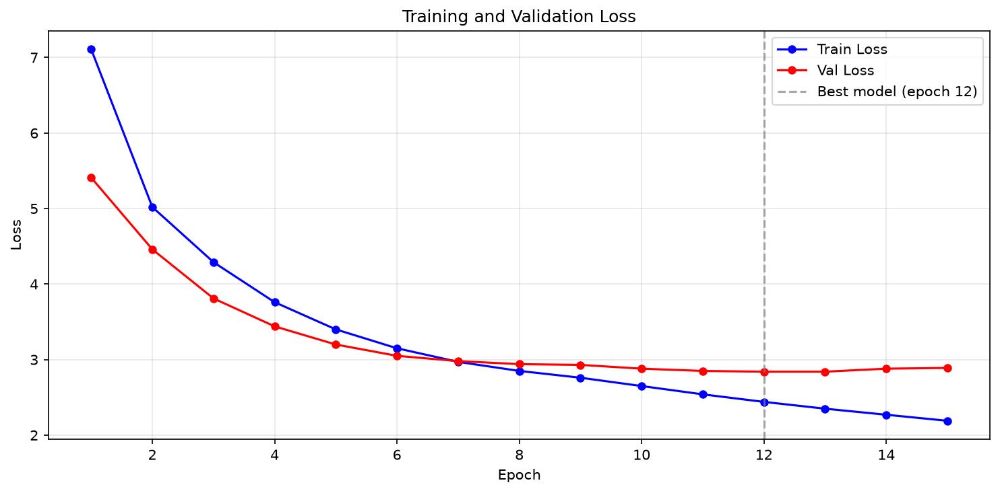

# Transformer from Scratch using Pytorch

A complete, paper-accurate implementation of the Transformer architecture
from ["Attention Is All You Need"](https://arxiv.org/abs/1706.03762) (Vaswani et al., 2017).

> Built from scratch in PyTorch. No HuggingFace. No `torch.nn.Transformer`. Every module implemented manually from the paper.

---
## Motivation

This project was built to understand the Transformer architecture from first principles by implementing every component described in the original paper : without relying on high-level libraries such as HuggingFace or PyTorch's built-in Transformer modules.

Reading "Attention Is All You Need" raised more questions than it answered. Building it resolved them.

## What's implemented

| Component | Paper Section | File |
|---|---|---|
| Scaled Dot-Product Attention | 3.2.1 | `layers/attention.py` |
| Multi-Head Attention | 3.2.2 | `layers/multihead_attention.py` |
| Positional Encoding | 3.5 | `layers/positional_encoding.py` |
| Feed-Forward Network | 3.3 | `layers/feed_forward.py` |
| Residual + LayerNorm | 3.1 | `layers/sublayer.py` |
| Encoder | 3.1 | `encoder.py` |
| Decoder | 3.1 | `decoder.py` |
| Full Transformer | 3 | `transformer.py` |
| Warmup LR Schedule | 5.3 | `train.py` |
| Label Smoothing | 5.4 | `train.py` |

---

## Results

### Training (15 epochs, RTX 2050, d_model=256, N=3, batch=64)

| Epoch | Train Loss | Val Loss |
|---|---|---|
| 1 | 7.11 | 5.41 |
| 5 | 3.40 | 3.20 |
| 12 | 2.44 | **2.84** ← best |
| 15 | 2.19 | 2.89 |

**Sample translations after 15 epochs:**

| German (Input) | Model Output | Ground Truth |
|---|---|---|
| ein mann spielt gitarre . | a man playing a guitar | a man is playing a guitar |
| eine frau läuft durch den park . | a woman is walking through the park . | a woman is walking through the park |
| zwei kinder spielen im garten . | two children play in the garden . | two children are playing in the garden |
| ein hund rennt über das feld . | a dog runs through the field . | a dog is running across the field |

### Ablation Studies

Trained 12 configurations (3 epochs each) varying one parameter at a time:

| Variable | Finding |
|----------|---------|
| Attention heads | Fewer heads converge faster short-term; more heads need longer training |
| Depth (N layers) | Deeper = slower convergence; N=6 needs 5x+ more training than N=1 |
| FFN size | Larger d_ff consistently improves — d_ff=2048 best across all runs |

See `ablation_results/results.json` and `notebooks/ablation_studies.ipynb` for full data.

## Visualizations

### Positional Encoding


### Attention Maps (Cross-Attention, Last Decoder Layer)


### Ablation Studies


### Training Curves


## Project structure

```
transformer-from-scratch/
├── layers/
│   ├── attention.py          # Scaled Dot-Product Attention
│   ├── multihead_attention.py
│   ├── positional_encoding.py
│   ├── feed_forward.py
│   └── sublayer.py           # Residual + LayerNorm
├── encoder.py
├── decoder.py
├── transformer.py
├── train.py                  # Training loop, masks, LR schedule
├── inference.py              # Greedy decoding
├── data.py                   # Custom dataset, vocab, dataloader
├── tests/
│   ├── test_attention.py
│   └── test_model.py
├── notebooks/
│   ├── attention_visualization.ipynb
│   └── positional_encoding.ipynb
└── NOTES.md                  # Implementation decisions explained
```

---

## Setup

```bash
git clone https://github.com/arushiiii18/transformer-from-scratch
cd transformer-from-scratch
python -m venv venv
venv\Scripts\activate        # Windows
pip install -r requirements.txt
```

Download Multi30k data:
```bash
python -c "from data import build_dataloaders; build_dataloaders()"
```

---

## Run

**Train:**
```bash
python train.py
```

**Translate:**
```bash
python inference.py
```

**Tests:**
```bash
python -m pytest tests/ -v
```

---

## Key implementation notes

**Why `-inf` masking and not `-1000`?**
`-inf` guarantees exactly `0` after softmax mathematically. Large negatives
leak small non-zero values and lose the semantic meaning of "this position
does not exist."

**Why sinusoidal positional encodings?**
PE(pos+k) can be represented as a linear function of PE(pos), allowing the
model to attend by relative position. Also generalizes to sequence lengths
unseen during training.

**Why feed-forward after attention?**
Attention decides *what* information to gather. The FFN decides *what to do*
with it. Two different jobs — both necessary.

See `NOTES.md` for full implementation reasoning.

---

## What I Learned

- Attention already existed before Transformers — the novelty was making it the primary computational mechanism, not an add-on to RNNs.
- Multi-head attention isn't repetition — each head specializes in different linguistic relationships simultaneously.
- Feed-forward layers have a distinct job from attention: attention decides *what* to gather, FFN decides *what to do* with it.
- Positional encodings exist specifically because removing recurrence broke the model's only way of knowing word order — every design choice creates a new problem.
- Ablation studies showed why each component exists rather than assuming design choices were arbitrary.

## References

- Vaswani et al., [Attention Is All You Need](https://arxiv.org/abs/1706.03762), 2017
